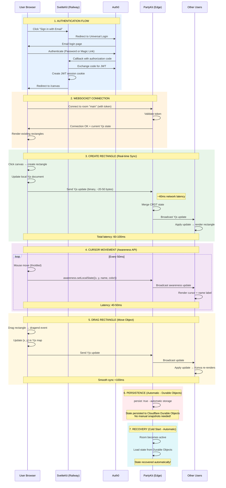

```mermaid
sequenceDiagram
    participant User as User Browser
    participant Railway as SvelteKit (Railway)
    participant Auth0
    participant PartyKit as PartyKit (Edge)
    participant User2 as Other Users

    %% Authentication
    rect rgb(230, 242, 255)
    Note over User,Auth0: 1. AUTHENTICATION FLOW
    User->>Railway: Click "Sign in with Email"
    Railway->>Auth0: Redirect to Universal Login
    Auth0->>User: Email login page
    User->>Auth0: Authenticate (Password or Magic Link)
    Auth0->>Railway: Callback with authorization code
    Railway->>Auth0: Exchange code for JWT
    Railway->>Railway: Create JWT session cookie
    Railway->>User: Redirect to /canvas
    end

    %% WebSocket Connection
    rect rgb(255, 243, 224)
    Note over User,PartyKit: 2. WEBSOCKET CONNECTION
    User->>PartyKit: Connect to room "main" (with token)
    PartyKit->>PartyKit: Validate token
    PartyKit->>User: Connection OK + current Yjs state
    User->>User: Render existing rectangles
    end

    %% Create Rectangle
    rect rgb(232, 245, 233)
    Note over User,User2: 3. CREATE RECTANGLE (Real-time Sync)
    User->>User: Click canvas → create rectangle
    User->>User: Update local Yjs document
    User->>PartyKit: Send Yjs update (binary, ~20-50 bytes)
    Note right of PartyKit: ~40ms network latency
    PartyKit->>PartyKit: Merge CRDT state
    PartyKit->>User2: Broadcast Yjs update
    User2->>User2: Apply update → render rectangle
    Note over User,User2: Total latency: 60-100ms
    end

    %% Cursor Movement
    rect rgb(243, 229, 245)
    Note over User,User2: 4. CURSOR MOVEMENT (Awareness API)
    loop Every 50ms
        User->>User: Mouse move (throttled)
        User->>PartyKit: awareness.setLocalState({x, y, name, color})
        PartyKit->>User2: Broadcast awareness update
        User2->>User2: Render cursor + name label
        Note over User,User2: Latency: 40-50ms
    end
    end

    %% Drag Rectangle
    rect rgb(255, 248, 225)
    Note over User,User2: 5. DRAG RECTANGLE (Move Object)
    User->>User: Drag rectangle → dragend event
    User->>User: Update {x, y} in Yjs map
    User->>PartyKit: Send Yjs update
    PartyKit->>User2: Broadcast update
    User2->>User2: Apply update → Konva re-renders
    Note over User,User2: Smooth sync <100ms
    end

    %% Persistence (Automatic via Durable Objects)
    rect rgb(255, 235, 238)
    Note over PartyKit: 6. PERSISTENCE (Automatic - Durable Objects)
    PartyKit->>PartyKit: persist: true - automatic storage
    Note over PartyKit: State persisted to Cloudflare Durable Objects<br/>No manual snapshots needed!
    end

    %% Cold Start Recovery
    rect rgb(224, 247, 250)
    Note over PartyKit: 7. RECOVERY (Cold Start - Automatic)
    PartyKit->>PartyKit: Room becomes active
    PartyKit->>PartyKit: Load state from Durable Objects
    Note over PartyKit: State recovered automatically!
    end
```
