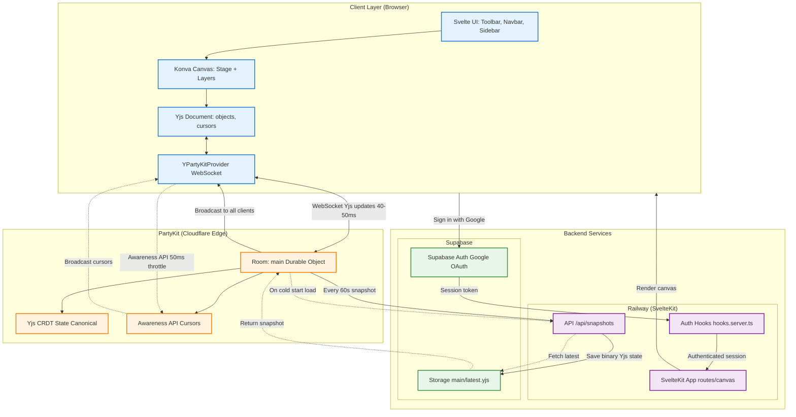

```mermaid
graph TB
    subgraph Browser["Client Layer (Browser)"]
        UI[Svelte UI: Toolbar, Navbar, Sidebar]
        Canvas[Konva Canvas: Stage + Layers]
        YDoc[Yjs Document: objects, cursors]
        Provider[YPartyKitProvider WebSocket]
        
        UI --> Canvas
        Canvas --> YDoc
        YDoc <--> Provider
    end

    subgraph Edge["PartyKit (Cloudflare Edge)"]
        Room[Room: main Durable Object]
        YCRDT[Yjs CRDT State Canonical]
        Awareness[Awareness API Cursors]
        
        Room --> YCRDT
        Room --> Awareness
    end

    subgraph Backend["Backend Services"]
        subgraph Railway["Railway (SvelteKit)"]
            App[SvelteKit App routes/canvas]
            API[API /api/snapshots]
            Hooks[Auth Hooks hooks.server.ts]
        end
        
        subgraph Supabase["Supabase"]
            Auth[Supabase Auth Google OAuth]
            Storage[Storage main/latest.yjs]
        end
    end

    %% Authentication Flow
    Browser -->|Sign in with Google| Auth
    Auth -->|Session token| Hooks
    Hooks -->|Authenticated session| App
    App -->|Render canvas| Browser

    %% Real-time Sync Flow
    Provider <-->|WebSocket Yjs updates 40-50ms| Room
    Room -->|Broadcast to all clients| Provider
    
    %% Cursor Flow
    Provider -.->|Awareness API 50ms throttle| Awareness
    Awareness -.->|Broadcast cursors| Provider

    %% Persistence Flow
    Room -->|Every 60s snapshot| API
    API -->|Save binary Yjs state| Storage
    
    %% Cold Start Flow
    Room -.->|On cold start load| API
    API -.->|Fetch latest| Storage
    Storage -.->|Return snapshot| Room

    %% Styling
    classDef clientStyle fill:#e3f2fd,stroke:#1976d2,stroke-width:2px
    classDef edgeStyle fill:#fff3e0,stroke:#f57c00,stroke-width:2px
    classDef backendStyle fill:#f3e5f5,stroke:#7b1fa2,stroke-width:2px
    classDef supabaseStyle fill:#e8f5e9,stroke:#388e3c,stroke-width:2px
    
    class UI,Canvas,YDoc,Provider clientStyle
    class Room,YCRDT,Awareness edgeStyle
    class App,API,Hooks backendStyle
    class Auth,Storage supabaseStyle
```