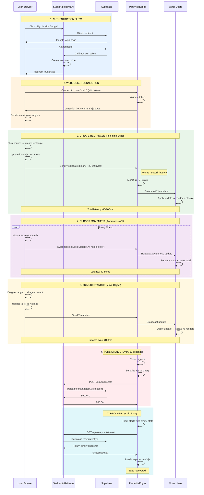

```mermaid
sequenceDiagram
    participant User as User Browser
    participant Railway as SvelteKit (Railway)
    participant Supabase
    participant PartyKit as PartyKit (Edge)
    participant User2 as Other Users

    %% Authentication
    rect rgb(230, 242, 255)
    Note over User,Supabase: 1. AUTHENTICATION FLOW
    User->>Railway: Click "Sign in with Google"
    Railway->>Supabase: OAuth redirect
    Supabase->>User: Google login page
    User->>Supabase: Authenticate
    Supabase->>Railway: Callback with token
    Railway->>Railway: Create session cookie
    Railway->>User: Redirect to /canvas
    end

    %% WebSocket Connection
    rect rgb(255, 243, 224)
    Note over User,PartyKit: 2. WEBSOCKET CONNECTION
    User->>PartyKit: Connect to room "main" (with token)
    PartyKit->>PartyKit: Validate token
    PartyKit->>User: Connection OK + current Yjs state
    User->>User: Render existing rectangles
    end

    %% Create Rectangle
    rect rgb(232, 245, 233)
    Note over User,User2: 3. CREATE RECTANGLE (Real-time Sync)
    User->>User: Click canvas → create rectangle
    User->>User: Update local Yjs document
    User->>PartyKit: Send Yjs update (binary, ~20-50 bytes)
    Note right of PartyKit: ~40ms network latency
    PartyKit->>PartyKit: Merge CRDT state
    PartyKit->>User2: Broadcast Yjs update
    User2->>User2: Apply update → render rectangle
    Note over User,User2: Total latency: 60-100ms
    end

    %% Cursor Movement
    rect rgb(243, 229, 245)
    Note over User,User2: 4. CURSOR MOVEMENT (Awareness API)
    loop Every 50ms
        User->>User: Mouse move (throttled)
        User->>PartyKit: awareness.setLocalState({x, y, name, color})
        PartyKit->>User2: Broadcast awareness update
        User2->>User2: Render cursor + name label
        Note over User,User2: Latency: 40-50ms
    end
    end

    %% Drag Rectangle
    rect rgb(255, 248, 225)
    Note over User,User2: 5. DRAG RECTANGLE (Move Object)
    User->>User: Drag rectangle → dragend event
    User->>User: Update {x, y} in Yjs map
    User->>PartyKit: Send Yjs update
    PartyKit->>User2: Broadcast update
    User2->>User2: Apply update → Konva re-renders
    Note over User,User2: Smooth sync <100ms
    end

    %% Persistence
    rect rgb(255, 235, 238)
    Note over PartyKit,Supabase: 6. PERSISTENCE (Every 60 seconds)
    PartyKit->>PartyKit: Timer triggers
    PartyKit->>PartyKit: Serialize Yjs to binary
    PartyKit->>Railway: POST /api/snapshots
    Railway->>Supabase: Upload to main/latest.yjs (upsert)
    Supabase->>Railway: Success
    Railway->>PartyKit: 200 OK
    end

    %% Cold Start Recovery
    rect rgb(224, 247, 250)
    Note over PartyKit,Supabase: 7. RECOVERY (Cold Start)
    PartyKit->>PartyKit: Room starts with empty state
    PartyKit->>Railway: GET /api/snapshots/latest
    Railway->>Supabase: Download main/latest.yjs
    Supabase->>Railway: Return binary snapshot
    Railway->>PartyKit: Snapshot data
    PartyKit->>PartyKit: Load snapshot into Yjs
    Note over PartyKit: State recovered!
    end
```